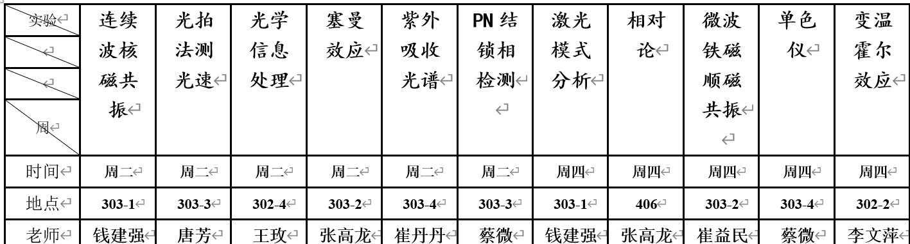

# 北航近代物理实验

北航物理学院大三学年将要上两学期的近代物理实验课程，上半年是基础性实验，下半年是探究性实验。

本仓库整理了上半年所做的十个实验，为学弟学妹提供一些参考。提供了

1. 实验报告模板和预习报告样例以及其对应tex文件
2. 相应数据分析程序以及绘图程序以及图像
3. 实验数据与部分问答题答案

希望你：
1. 不要照抄，辩证分析借鉴
2. 尽早学会用latex和其他编程语言分析数据以及可视化物理过程, and Github
3. 对于原理一定要弄懂，物理实验的目的就是为了让大家对物理过程有着直观的感受与认识，开源这个仓库的目的也是为了让大家少花时间在写实验报告上。
   
本学期排课如下所示：

所做十个实验为：
[pn结单边杂质分布锁相检测](./pn%E7%BB%93%E5%8D%95%E8%BE%B9%E6%9D%82%E8%B4%A8%E5%88%86%E5%B8%83%E9%94%81%E7%9B%B8%E6%A3%80%E6%B5%8B/pn%E7%BB%93.pdf)
[光学运算](./%E5%85%89%E5%AD%A6%E8%BF%90%E7%AE%97/Optical_operation.pdf)
[光拍法测光速](./%E5%85%89%E6%8B%8D%E6%B3%95%E6%B5%8B%E5%85%89%E9%80%9F/%E5%85%89%E6%8B%8D%E6%B3%95%E6%B5%8B%E5%85%89%E9%80%9F.pdf) 
[利用beta射线验证相对论动能关系](./%E5%88%A9%E7%94%A8beta%E5%B0%84%E7%BA%BF%E9%AA%8C%E8%AF%81%E7%9B%B8%E5%AF%B9%E8%AE%BA%E5%8A%A8%E9%87%8F%E5%8A%A8%E8%83%BD%E5%85%B3%E7%B3%BB/%E5%88%A9%E7%94%A8beta%E5%B0%84%E7%BA%BF%E9%AA%8C%E8%AF%81%E7%9B%B8%E5%AF%B9%E8%AE%BA%E5%8A%A8%E8%83%BD%E5%8A%A8%E9%87%8F%E5%85%B3%E7%B3%BB.pdf)
[单色仪](./%E5%8D%95%E8%89%B2%E4%BB%AA/monochromator.pdf)
[变温霍尔效应](./%E5%8F%98%E6%B8%A9%E9%9C%8D%E5%B0%94%E6%95%88%E5%BA%94/%E5%8F%98%E6%B8%A9%E9%9C%8D%E5%B0%94%E6%95%88%E5%BA%94.pdf)
[塞曼效应](./%E5%A1%9E%E6%9B%BC%E6%95%88%E5%BA%94/Zeemann_effect.pdf)
[微波铁磁顺磁共振](./%E5%BE%AE%E6%B3%A2%E9%93%81%E7%A3%81%E9%A1%BA%E7%A3%81%E5%85%B1%E6%8C%AF/MPFR.pdf)
[激光模式分析](./%E6%BF%80%E5%85%89%E6%A8%A1%E5%BC%8F%E5%88%86%E6%9E%90/%E6%B0%A6%E6%B0%96%E6%BF%80%E5%85%89%E5%99%A8%E6%A8%A1%E5%BC%8F%E5%88%86%E6%9E%90.pdf)
[连续波核磁共振](./%E8%BF%9E%E7%BB%AD%E6%B3%A2%E6%A0%B8%E7%A3%81%E5%85%B1%E6%8C%AF/%E8%BF%9E%E7%BB%AD%E6%B3%A2%E6%A0%B8%E7%A3%81%E5%85%B1%E6%8C%AF.pdf)

因疫情原因缺失紫外光谱实验。